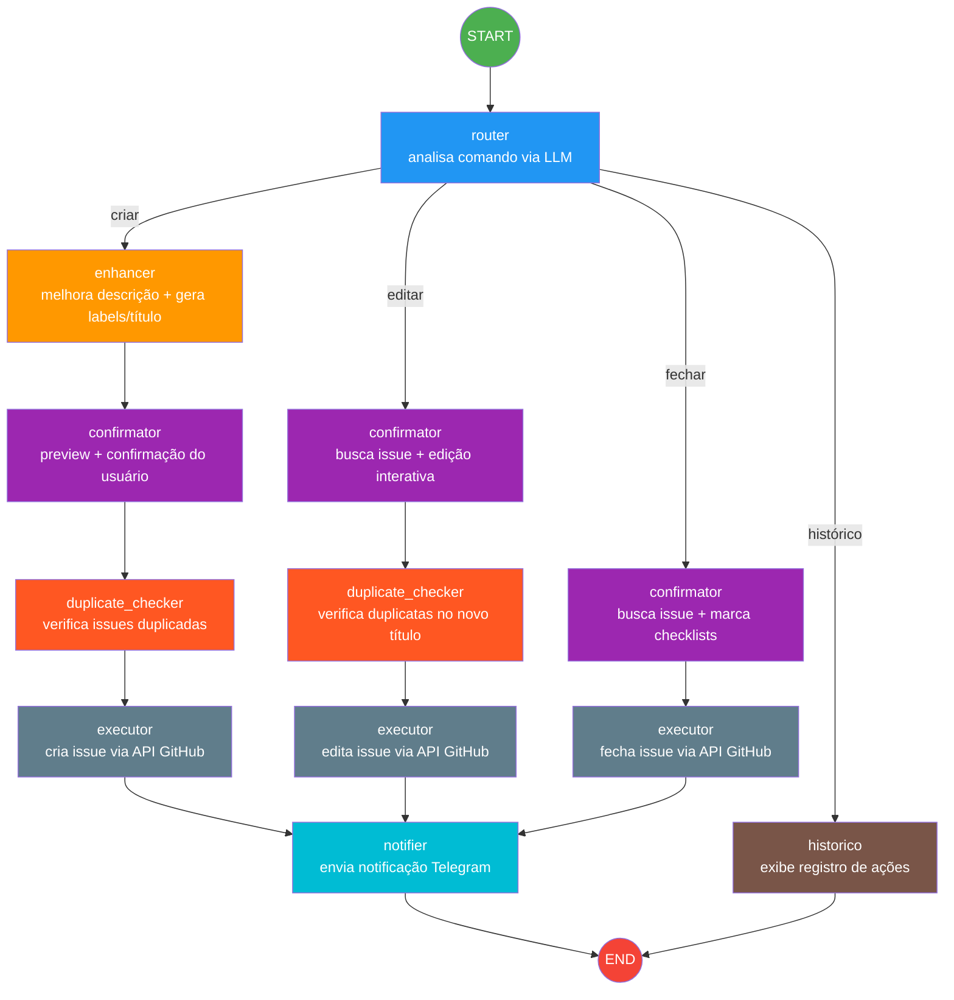

# GitHub Manager Agent

Agente autônomo de gerenciamento de issues do GitHub com notificações via Telegram, construído com LangGraph e LLM local (Ollama).

## Problema

Gerenciar issues no GitHub manualmente é trabalhoso e fragmentado: criar issues com descrições detalhadas, aplicar labels corretas, manter critérios de aceitação consistentes, evitar duplicatas e acompanhar mudanças. Este agente automatiza todo esse ciclo de vida a partir de comandos simples digitados no terminal.

## Objetivo

O agente interpreta comandos em linguagem natural (`criar`, `editar`, `fechar`, `histórico`) e executa ações correspondentes na API REST do GitHub, enriquecendo automaticamente títulos, descrições e labels com o auxílio de um LLM local. Após cada operação, envia uma notificação formatada para o Telegram.

## Geração Assistida por IA

Ao **criar** uma issue, o usuário fornece apenas uma descrição resumida do problema ou necessidade (ex: "bug no login quando email tem caracteres especiais"). O agente utiliza o LLM local para transformar essa entrada curta em uma issue completa, gerando automaticamente:

- **Título** claro e descritivo (máximo 72 caracteres).
- **Labels** a partir de um conjunto fixo (`fix/bug`, `feature`, `infra`, `backend`, `frontend`, `docs`).
- **Descrição detalhada** em Markdown com seções de *Descrição* e *Critérios de Aceitação* (no mínimo 3 checkboxes `- [ ]`).

O usuário visualiza um preview da issue proposta e pode confirmar, editar manualmente ou cancelar antes de enviar ao GitHub.

Ao **editar** uma issue existente, o fluxo é semelhante: o usuário informa uma nova descrição resumida com as mudanças desejadas, e o LLM gera uma nova versão do título, labels e descrição. O usuário revisa as sugestões antes de confirmar a alteração.

## Funcionamento Geral

O fluxo é orquestrado por um grafo de estados (`LangGraph`) com os seguintes nós:



### Verificação de Duplicatas

Antes de criar ou editar uma issue, o agente verifica automaticamente se há issues duplicadas no repositório:

1. **Listagem**: Busca todas as issues abertas no repositório via API GitHub.
2. **Similaridade de título**: Calcula a similaridade entre o título da nova issue e cada issue aberta. Se ≥ 70%, marca como duplicata potencial.
3. **Código de task**: Extrai códigos de tarefa (ex: `TASK-001`, `#123`) do texto e verifica se já existem em outras issues.
4. **Alerta interativo**: Se duplicatas forem detectadas, exibe um alerta com até 5 ocorrências, mostrando o número, título e motivo da similaridade.
5. **Decisão do usuário**: Pergunta se deseja prosseguir mesmo assim ou cancelar a operação.

```
🔍 Verificando duplicatas no repositório owner/repo...
   Encontradas 20 issues abertas

==================================================
⚠️  ALERTA: ISSUES DUPLICADAS DETECTADAS!
==================================================

   • #15: Criar sistema de cadastro de hardware
     Motivo: Título similar (85%)

   • #22: Cadastro de equipamentos
     Motivo: Código de task duplicado (TASK-042)

==================================================

Deseja prosseguir mesmo assim?
  1-Sim, prosseguir (criará issue duplicada)
  2-Não, cancelar
→
```

### Ferramentas

| Ferramenta | Descrição |
|---|---|
| **Ollama** | LLM local para interpretação de comandos, geração de títulos/labels e melhoria de descrições |
| **GitHub API REST** | CRUD de issues (criar, editar, fechar, listar) via `requests` |
| **Telegram Bot API** | Notificações push ao concluir operações no GitHub |
| **LangGraph** | Orquestração do fluxo com nós, arestas condicionais e `MemorySaver` para persistência |
| **Pydantic** | Validação do schema estruturado (`GitActionSchema`) das ações extraídas |

## Como Executar

### Pré-requisitos

- Python 3.10+
- [Ollama](https://ollama.ai) instalado e rodando
- Token de acesso do GitHub (com escopo `repo`)
- Bot do Telegram configurado via [@BotFather](https://t.me/BotFather)

### 1. Instale as dependências

```bash
pip install -r requirements.txt
```

### 2. Baixe o modelo Ollama

```bash
ollama pull llama3.2:3b
```

### 3. Crie o token de acesso do GitHub (Personal Access Token)

1. Acesse [github.com/settings/tokens?type=beta](https://github.com/settings/tokens?type=beta) e clique em **Generate new token (primeira opção que contém Fine-grained, repo-scoped)**.
2. Dê um nome descritivo (ex: `github-manager-agent`).
3. Em **Resource owner**, selecione sua conta ou organização.
4. Em **Repository access**, selecione uma das três opções de acesso aos repositórios que terá permissão no token para o gerenciamento das issues (**opção recomendada: Only select repositories**, selecionando apenas os respositórios que o agente terá permissão pelo token para gerenciar as issues).
5. Em **Permissions**, clique em **Add permissions** e adicione a permissão **Issues** com o nível **Read and Write**.
6. Clique em **Generate token** e copie o valor gerado (`github_pat_...`).

> Anote o token imediatamente — ele não será exibido novamente.

### 4. Crie o bot no Telegram

1. Abra o Telegram e acesse [@BotFather](https://t.me/BotFather).
2. Envie o comando `/newbot`.
3. Informe um nome para o bot (ex: `GitHub Manager Bot`).
4. Informe um username único (ex: `meu_github_manager_bot`) — deve terminar com `bot`.
5. O BotFather enviará o **token** do bot (formato `123456789:ABCdefGHI...`). Copie-o.

Para obter o **chat_id**:

1. Inicie uma conversa com seu bot no Telegram e envie qualquer mensagem.
2. Acesse `https://api.telegram.org/bot<SEU_TOKEN>/getUpdates` no navegador.
3. Procure o campo `"chat":{"id":` na resposta — esse é o seu **chat_id**.

### 5. Configure as variáveis de ambiente

```bash
cp .env.example .env
```

Edite o arquivo `.env` com seus valores reais:

```env
GITHUB_TOKEN=ghp_xxxxxxxxxxxxxxxxxxxx
TELEGRAM_TOKEN=123456789:ABCdefGHIjklMNOpqrsTUVwxyz
TELEGRAM_CHAT_ID=123456789
OLLAMA_MODEL=llama3.2:3b
```

### 6. Inicie o Ollama

```bash
ollama serve
```

### 7. Execute o agente

```bash
python -m src.main
```

## Exemplos de Uso

### Criar uma issue

```
📦 Informe o repositório (owner/repo): meu-usuario/meu-repo
📦 Repositório selecionado: meu-usuario/meu-repo

💬 Digite seu comando: criar
📄 Descrição (obrigatório):
  > Bug no login quando usuário usa email com caracteres especiais

========================================
📝 Criar Nova Issue
📦 Repositório: meu-usuario/meu-repo
📌 Título: Corrigir validação de email com caracteres especiais
🏷️ Labels: fix/bug
📄 Descrição:
## Descrição

O campo de email no formulário de login não aceita endereços que contêm
caracteres especiais como `+`, `-` ou `.`, resultando em erro 400 para
usuários com emails válidos que utilizam esses caracteres.

**Comportamento esperado:** O campo aceita qualquer email válido conforme RFC 5322.
**Comportamento atual:** Emails com `+`, `-` ou `.` após o `@` retornam erro de validação.

## Critérios de Aceitação
- [ ] O campo de email aceita endereços com caracteres `+`, `-` e `.`
- [ ] Mensagem de erro clara quando o formato do email for inválido
- [ ] Testes unitários cobrindo os casos de email com caracteres especiais
- [ ] Validação no frontend e backend mantida de forma consistente
========================================

Confirma a operação?
  1-Confirmar
  2-Editar
  3-Cancelar
→ 1
🔍 Verificando duplicatas no repositório meu-usuario/meu-repo...
   Encontradas 20 issues abertas
                       
✅ Issue criada com sucesso!
   📌 #42 - Corrigir validação de email com caracteres especiais
   🔗 https://github.com/meu-usuario/meu-repo/issues/42

  - 📱 Enviando notificação via Telegram...
✅ Notificação enviada via Telegram!
```

### Editar uma issue

```
💬 Digite seu comando: editar 42

✏️  Editar Issue
📌 Título atual: Corrigir validação de email com caracteres especiais
🏷️ Labels atuais: fix/bug
📄 Descrição atual:
## Descrição
O campo de email no formulário de login não aceita endereços com caracteres especiais...

Nova descrição resumida:
  > Adicionar suporte a emails com '+' e '-'

========================================

🤖 Sugestões do agente:

📌 Título: Expandir validação de email para caracteres '+' e '-'
🏷️ Labels: fix/bug, backend
📄 Descrição:
## Descrição

A validação de email precisa ser expandida para aceitar os caracteres `+` e `-` em qualquer posição do endereço, garantindo conformidade com a RFC 5322.

## Critérios de Aceitação
- [ ] Regex de validação aceita `+` e `-` no local-part do email
- [ ] Mensagem de erro específica para formato inválido
- [ ] Testes unitários para emails com `+`, `-` e combinações
========================================

Confirma a operação?
  1-Confirmar
  2-Editar
  3-Cancelar
→ 1
   🔍 Verificando duplicatas no repositório meu-usuario/meu-repo...
   Encontradas 20 issues abertas
                       
✅ Issue editada com sucesso!
   📌 #42 - Teste de Log - Erro ao gravar logs
   🔗 https://github.com/meu-usuario/meu-repo/issues/42

  - 📱 Enviando notificação via Telegram...
✅ Notificação enviada via Telegram!
```

### Fechar uma issue

```
💬 Digite seu comando: fechar 42

📋 Esta issue possui critérios de aceitação.
 Deseja marcar como concluídos?
  1-Sim
  2-Não
→ 1

========================================
🔒 Fechar Issue #42
📌 Título: Expandir validação de email para caracteres '+' e '-'
🏷️  Labels: fix/bug, backend
📄 Descrição:
## Descrição

A validação de email precisa ser expandida para aceitar os caracteres `+` e `-` em qualquer posição do endereço, garantindo conformidade com a RFC 5322.

## Critérios de Aceitação
- [x] Regex de validação aceita `+` e `-` no local-part do email
- [x] Mensagem de erro específica para formato inválido
- [x] Testes unitários para emails com `+`, `-` e combinações
========================================

Confirma o fechamento desta issue?
  1-Sim
  2-Não
→ 1

✅ Issue fechada com sucesso!
    📌 #42 - Corrigir validação de email com caracteres especiais
    🔗 https://github.com/meu-usuario/meu-repo/issues/42

     - 📱 Enviando notificação via Telegram...
✅ Notificação enviada via Telegram!
```

### Exibir histórico

```
💬 Digite seu comando: histórico

==================================================
📋 Histórico de Issues (meu-usuario/meu-repo)
==================================================
  1. Fechada - #42 Expandir validação de email para caracteres '+' e '-'
  2. Editada - #42 Expandir validação de email para caracteres '+' e '-'
  3. Criada - #42 Corrigir validação de email com caracteres especiais
==================================================
```

## Estrutura do Projeto

```
github-manager-agent/
├── .env.example          # Variáveis de ambiente necessárias
├── requirements.txt      # Dependências Python
├── README.md
├── src/
│   ├── main.py           # Ponto de entrada e loop do terminal
│   └── agent/
│       ├── __init__.py
│       ├── graph.py      # Grafo LangGraph, nós e roteamento
│       ├── github_tool.py   # Integração com API GitHub
│       └── telegram_tool.py # Notificações via Telegram
├── docs/
│   ├── tasks.md          # Backlog do projeto
│   ├── prompts.md        # Documentação dos prompts utilizados
│   └── slides.html       # Apresentação do projeto
└── tests/                # Testes unitários
```

## Documentação

| Arquivo | Descrição |
|---|---|
| [tasks.md](docs/tasks.md) | Backlog do projeto com listagem de tasks, prioridades e status |
| [prompts.md](docs/prompts.md) | Documentação dos prompts utilizados nos nós do agente |
| [slides.html](docs/slides.html) | Apresentação interativa do projeto |

## Comandos Disponíveis

| Comando | Descrição |
|---|---|
| `criar` | Cria uma nova issue (solicita descrição interativamente) |
| `editar <número>` | Edita uma issue existente |
| `fechar <número>` | Fecha uma issue (com opção de marcar checklists) |
| `histórico` | Exibe o histórico de ações realizadas |
| `sair` | Encerra o agente |
